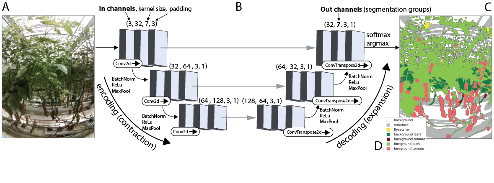

# Muroran IT - LAI network

Estimating the Leaf Area Index from a set of RGB frames of vine plants

This repository acts as supplementary information for the publication "Non-destructive Leaf Area Index estimation via guided optical imaging using UNET segmentation for large scale greenhouse environments" by Stefan Baar, Yosuke Kobayashi, Tatsuro Horie, Kazuhiko Sato, Hidetsugu Suto, Shinya Watanabe.

In the paper, we analyzed the LAI evolution of two tomato species over the time span of three years and compared the results to manually obtained LAI estimations.

This contains scripts for the following processing steps:
- image preparation
- UNET training
- inference

## Setup

We do not provide a pip package yet. Just git clone the repository and run within the main directory. This project was written for python 3.8-dev, but all python version from 3.6 should also work.

## Notebooks

... coming soon ...

## Data

We can not provide any sample data as of now.
